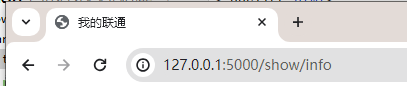

# Python的web开发全家桶（django+前端+数据库）

https://www.bilibili.com/video/BV1rT4y1v7uQ

# 前端开发

```
- 前端开发：HTML、CSS、JavaScript
- Web框架：接受请求并处理
- MySQL数据库：存储数据地方

快速上手：
	基于Flask Web框架快速搭建一个网站

深入学习：
	基于Django框架（主要）
```


## 1. 快速开发网站

```
pip install flask -i https://pypi.douban.com/simple
```

```python
from flask import Flask,render_template

app = Flask(__name__)


@app.route('/show/info')
def index():
    # return '中国联通'
    return render_template('index.html')


if __name__ == '__main__':
    app.run()

```

```htm
<!DOCTYPE html>
<html lang="en">
<head>
    <meta charset="UTF-8">
    <title>Title</title>
</head>
<body>
    <h1>中国联通</h1>
</body>
</html>
```


## 2. 浏览器识别的标签

### 2.1 编码（head）

```html
<meta charset="UTF-8">
```

### 2.2 title(head)

```html
<title>我的联通</title>
```



### 2.3 标题

```html
<h1>中国联通</h1>
<h2>中国联通</h2>
<h3>中国联通</h3>
<h4>中国联通</h4>
```

### 2.4 div和span

```html
<div>
    内容
</div>
<span> 内容 </span>
```

- div 一个标签占据一行。【块级标签】


- span 标签多大就占多少。【行内标签、内联标签】

### 2.5 超链接

```html
<a href=‘’>点击跳转</a>
```

### 2.6 图片

```html

```

### 2.7 列表

```html
无序列表
<ul>
    <li></li>
</ul>

有序列表
<ol>
    <li></li>
</ol>
```

### 2.8 表格

```html
<table>
    <thead>
    	<tr> <td></td> </tr>
    </thead>
    <tbody>
    	<tr>  <td></td> </tr> 第一行
    </tbody>
</table>
```

### 2.9 input系列

```html
<input type="text" />
<input type="password" >
<input type="file" >

<input type="radio" name="n1" >男
<input type="radio" name="n1" >女

<input type="checkbox" >篮球
<input type="checkbox" >足球
<input type="checkbox" >棒球

<input type="button" value="提交" >  --普通按钮
<input type="submit" value="提交" >  --提交表单	

```

### 2.10 下拉框

```html
<select> 单选
    <option>选项1</option>
    <option>选项2</option>
    <option>选项3</option>
</select>

<select multiple> 多选
    <option>选项1</option>
    <option>选项2</option>
    <option>选项3</option>
</select>
```

### 2.11 多行文本

```html
<textarea></textarea>
```

## 3.网络请求

- GET请求

  现象：GET请求、跳转、后台传入数据 （数据拼接到url）

- POST请求

  现象：提交数据（数据放在请求体）

## 4.数据提交

页面数据提交后台：

- form标签包裹的提交的数据的标签
  - 提交方式：metho=“get/post“
  - 提交的地址： action = ”xx/xx“
  - 必须包含一个submit标签

## 5.CSS样式

css专门”美化标签

- 基础css，写简单页面
- 模板，调整与修改

### 5.1 应用方式

1、在标签上写

2、在head标签写style标签

3、写到文件中

### 5.2 选择器

#### 1. 类选择器

#### 2. ID选择器

#### 3. 标签选择器

#### 4. 属性选择器

#### 5. 后代选择器

### 5.3 样式

#### 1.高度与宽度

 #### 2.块级标签及行内标签

#### 3.字体及颜色

